# Automated Experimentation Platform

## Table of contents

- [Automated Experimentation Platform](#automated-experimentation-platform)
  - [Table of contents](#table-of-contents)
  - [Project Structure](#project-structure)
  - [Platform Architecture](#platform-architecture)
    - [Services orchestrated with Docker Compose](#services-orchestrated-with-docker-compose)
  - [How To Use](#how-to-use)
    - [Airflow](#airflow)
    - [MLFlow](#mlflow)
    - [Examples of use](#examples-of-use)
  - [Other MLOps platforms](#other-mlops-platforms)
    - [Comparison with other platforms](#comparison-with-other-platforms)
    - [Comparison of other Workflow Orchestration Tools](#comparison-of-other-workflow-orchestration-tools)
      - [Airflow](#airflow-1)
      - [MLflow](#mlflow-1)
  - [Prerequisites](#prerequisites)
  - [End-to-end real case scenario](#end-to-end-real-case-scenario)

## Project Structure
The repository is organized as follows:


```bash
src
├── compose.yml  # Docker Compose file to orchestrate the complete deployment of the platform
├── mlflow/
    ├── Dockerfile # Dockerfile to build amd Docker image for MLFlow server
    ├── requirements.txt   # Requirements file for MLFLow server
    └── Dockerfile   # Dockerfile to create custom Airflow image, yo include git and all requeriments
├── License  # License File, MIT license
├── README.md  # Readme file 
└── gitignore.yml # Git ignore file, to ignore some non-needed file in the reposotory
```

## Platform Architecture

Following image presents a schematic representation of the platform architecture and illustrates the interaction between modules within the automated experimentation ecosystem.

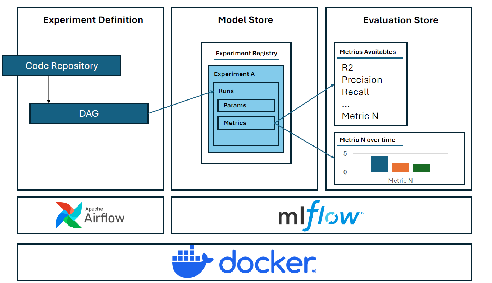

### Services orchestrated with Docker Compose

The platform orchestrates the following services using Docker Compose:

1. **Airflow**:
* Description: A workflow orchestrator for complex workflows, it is a custom image with several dependencies already included, such as Git and MLFlow. 
* Exposed Port: 8080
* Build: Built from the Dockerfile located in the root directory.
* Dependencies: This service consists of multiple services/containers, which make up the various common modules of Airflow:
  * **postgres**: Database container that stores metadata, DAG states, and task information.
  * **flower**: Provides a web-based monitoring tool for Celery (as integrated library within Airflow) workers and task queues.
  * **redis**: Acts as a message broker for Celery (for Celery Executor), enabling communication between scheduler and workers.
  * **airflow-webserver**: Hosts the web UI where users can monitor, trigger, and manage workflows (DAGs).
  * **airflow-scheduler**: Responsible for scheduling tasks and triggering DAG runs based on defined intervals and dependencies.
  * **airflow-worker**: Executes the tasks assigned by the scheduler
  * **airflow-triggerer**: Handles deferred and asynchronous tasks, improving efficiency for long-running operations.
  * **airflow-init**: Initializes the environment, sets up the database, and creates the initial user.
  * **airflow-cli**: A lightweight utility container used to run Airflow CLI commands interactively or on demand, sharing the same environment as other Airflow services.

2. **Mlflow**:
* Description: Experiment tracking and evaluation store. Allos to easily stored results and compare results
* Exposed Port: 5050
* Build: Built from the Dockerfile located in the /mlflow directory.


## How To Use

To deploy the platform, execute the following command where the compose.yml file is located.

```bash
docker-compose up --build -d
```

If when execute the docker compose command the return is *no configuration file provided: not found* probabily path is not correct , execute *cd src* command to change path to *src* directory, where compose.yml file is located

This command reads the Compose specification and instantiates all required services, creating and orchestrating the corresponding containers, parameter description:

* **--build**: Rebuild the Docker images being used in the compose.yml file. If Docker images already exists in your Docker instance, you can remove this parameter, in case of doubt, it is recommended that you always use this option
* **-d**: Unattended mode, the terminal is not locked using the standard Docker exit. You can disable this option if you want to view the Docker standard output log, but we recommend viewing the log from Docker Desktop or using the *docker container logs* command.

This command will deploy all the Docker containers needed to use the platform, which mainly consists of Airflow as the orchestrator (made up of different containers to deploy all its functionality) and MLFlow as the Model/Experiment Registry. 

Experiments could be orchestrated through Apache Airflow using DAGs. The recommended execution strategy consists of dynamically retrieving experiment definitions from an external Git-based repository, executing the defined workflows, and optionally removing the downloaded repository afterwards. This approach ensures that the most recent version of the experimental code is always used while avoiding unnecessary storage consumption within the platform.

Airflow Docker image is custom, so some additional dependecies are installed, like Git or MLFlow.

After the platform is deployed, four new folder will appear:

* **config**: For override Airflow confing, it is not recommended to use it.
* **dags**: For Aiflow dags, **put all your dags and Python Scripts here**. (1)
* **logs**: Log generated by Airflow.
* **plugins**: For Airflow pluggins, it is not recommended to use it.

Once the platform is deployed, the neeeded Docker containers are created, the following image shown the containers deployed

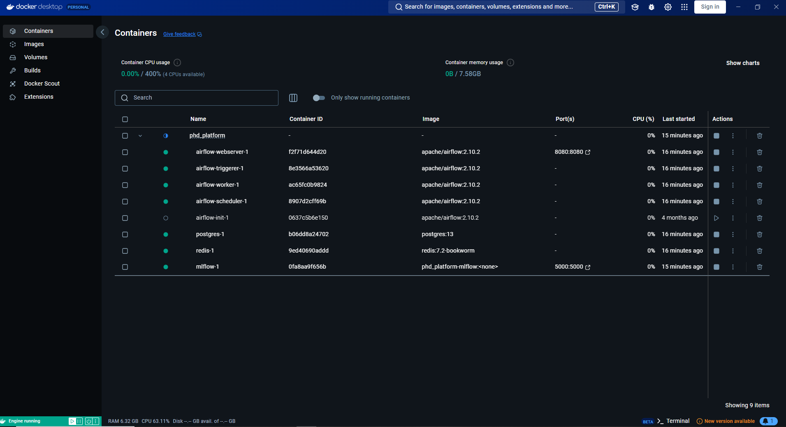

### Airflow

To use airflow:

* User interface could be open at http://localhost:8080/ and login with user/password airflow/airflow
* Dags should be added at dags folder, create when docker compose up cammands was executed
* For more info about how to create dags check Airflow documentation: https://airflow.apache.org/docs/apache-airflow/stable/tutorial/index.html

### MLFlow

To user MLFlow:

* User interface could be open at http://127.0.0.1:5000/ ,no login its requeired
* To create experiments and runs use the MLFLow Python SDK 

### Examples of use

If you want examples of real-world use of the platform, such as orchestrating an experiment in a workflow/DAGs, Python scripts, and connecting to MLFlow to send and save results, download the following repository https://github.com/RubenCardos/phd_workflows in the “DAGs” (1) directory, which contains several examples of real-world use of the platform.

* elastic_patterns_experiment_1.py : Experiment to classify handwritten numbers, MNIST dataset, and storage results in MLFlow.
* elastic_patterns_experiment_1_versioning.py : Same as experiment 1, but using a code repository to storage the source code of experiment since the platform have a source version control (git) tool.
* elastic_patterns_experiment_2: Experiment to classify brest cancer samples and storage results to MLFlow

For this examples its recommends to create two pools in airflow, to create a pool in Airflow UI go to Admin > Pools and add a new pool, recommended pools are:

* experiment_1_pool with two sloots
* experiment_2_pool with six sloots

## Other MLOps platforms

### Comparison with other platforms

A key distinction of the proposed platform is the explicit separation between pipeline execution and experiment execution. While most MLOps frameworks focus on pipeline orchestration, the proposed system introduces a native experimental parallelism model, where multiple configurations are executed as independent, comparable units.

MLflow is not only used for tracking, but as a structured experiment database, where parameterised runs can be grouped, filtered, and analysed without additional tooling.

| Feature                          | Proposed Platform | Kubeflow   | MLflow Recipes |
|----------------------------------|------------------|------------|----------------|
| Lightweight deployment           | Yes              | No         | Yes            |
| Combinatorial experiment support | Yes              | Partially  | No             |
| Parallel experimentation (research-oriented) | Yes | Partially | No |
| Reproducibility (end-to-end)     | Yes              | Yes        | Partially      |
| Experiment tracking       | Yes  | Partial  | Yes   |
| Infrastructure requirements                 | Low     | High (K8s)| Low           |
| Domain-specific                  | No               | No         | No             |

Unlike general-purpose MLOps platforms, the proposed system is specifically designed to support research-oriented experimentation involving combinatorial parameter spaces and systematic multi-run evaluation.

Other MLops platform: 

* *Kubeflow* is an MLOps platform for scalable machine learning workflows on Kubernetes, supporting pipelines, distributed training, and cloud integration. However, it requires a Kubernetes cluster and significant configuration, which can add complexity in lightweight research environments. Kubeflow provides strong support for pipeline parallelism and scalable execution on Kubernetes, but it does not natively support systematic combinatorial experiment generation. Implementing this requires custom logic on top of pipelines, making it less suitable for structured research experimentation.

* *MLflow Recipes* (previously known as MLflow Pipelines) focus on structuring machine learning workflows and tracking experiments, provides experiment logging, model versioning, and reproducibility support, but mainly offers templates and tracking, relying on external tools for orchestration and large-scale execution. MLflow Recipes focus on standardizing ML workflows and tracking experiments, but lack on orchestration capabilities, parallel execution or combinatorial experiment generation.

Unlike existing MLOps platforms, which primarily focus on pipeline orchestration and production deployment, the proposed platform is explicitly designed for systematic experimental evaluation in research contexts. Its main contribution lies in enabling automated combinatorial experiment generation and native experimental parallelism, where multiple configurations are executed, tracked, and compared as independent units. This approach addresses a gap in current MLOps ecosystems, where experimentation is often treated as a secondary concern rather than a first-class concept.

### Comparison of other Workflow Orchestration Tools

#### Airflow

Apache Airflow is a widely adopted workflow orchestration framework based on Directed Acyclic Graphs (DAGs), enabling explicit definition, scheduling, and monitoring of complex pipelines. Its flexibility and extensibility make it particularly suitable for structuring reproducible machine learning workflows.

Several alternative orchestration tools exist, each offering different trade-offs:

- *Prefect*, provides a more modern and user-friendly API compared to Airflow, with improved handling of dynamic workflows and failure states. However, its ecosystem is less mature, and it is more tightly coupled to its own execution model, which may limit portability in highly controlled research environments.
  
- *Luigi*, developed by Spotify, offers a simpler pipeline abstraction with strong dependency management. Nevertheless, it lacks advanced scheduling capabilities and native support for distributed execution, making it less suitable for parallel experimentation at scale.
  
- *Dagster*, introduces a software-defined asset paradigm and strong typing for pipelines, improving observability and maintainability. However, its abstraction model introduces additional complexity and is less aligned with the lightweight, script-based experimentation approach adopted in this work.


In contrast to these alternatives, Apache Airflow offers a balanced combination of maturity, flexibility, and infrastructure independence, making it particularly suitable for research-oriented experimentation. Its DAG-based model allows explicit control over execution logic, while features such as task parallelism, execution pools, and scheduling enable controlled concurrent execution of multiple experimental configurations. These characteristics align closely with the requirements of systematic and reproducible experimentation.

#### MLflow

MLflow is an open-source platform designed to manage the machine learning lifecycle, including experiment tracking, parameter logging, model versioning, and artefact storage. Its modular design and lightweight deployment make it particularly suitable for integration into custom MLOps infrastructures.

Alternative tools in this space include:

- *Weights & Biases (W&B)*: provides a rich user interface, real-time visualisation, and collaborative features. However, it is primarily offered as a cloud-based service, which may introduce constraints related to data governance, reproducibility, and dependency on external infrastructure.

- *Neptune.ai*: offers advanced experiment tracking and metadata management, with strong support for collaboration and monitoring. Similar to W&B, it relies heavily on a hosted platform, making it less suitable for fully self-contained and reproducible environments. Neptune AI has recently been acquired by OpenAI, so its future is not guaranteed in the near future.
  
- *Sacred* is a lightweight experiment configuration and tracking framework that emphasises reproducibility. While flexible, it lacks integrated model registry capabilities and does not provide a unified interface for large-scale experiment analysis.

- *TensorBoard* is widely used for visualising training metrics, particularly within the TensorFlow ecosystem. However, it is primarily a visualisation tool and does not offer comprehensive experiment management, parameter tracking, or model versioning.

Compared to these alternatives, MLflow provides a self-hosted, framework-agnostic, and modular solution that integrates seamlessly with existing workflows. In the proposed platform, MLflow is not only used for experiment tracking but also acts as a centralised repository of experimental knowledge, where parameters, metrics, and artefacts are systematically stored and queried. This capability is particularly relevant in scenarios involving combinatorial experimentation, where large numbers of runs must be organised, filtered, and compared in a structured manner.

## Prerequisites

The only requirement for deploying and using the platform is that Docker be installed, we also recommend installing the Docker Desktop tool. For more information on how to install the needed tools, please visit the folling links:

* For Docker: https://docs.docker.com/engine/install/

* For Docker Desktop: https://docs.docker.com/desktop/setup/install/windows-install/

Please note that installing Docker on Windows may require the WSL component. For more information, please visit to the following links
https://learn.microsoft.com/es-es/windows/wsl/install  https://docs.docker.com/desktop/features/wsl/

## End-to-end real case scenario

To show the capabilities of the propose platform, a real case end-to-end scenario is gping to be show, with a step-by-step guide:

1. Download the repository, navigate to the *phd_platform* directory, and then to the *src* (phd_platform/src) directory.

2. Check that Docker is running, for example, open Docker Desktop and wait until "Engine Running" on a green backgound is show on the left botton corner.
   
3. Execute the command *docker-compose up --build -d* and wait until plafotm is deployed, you can verify this by accessing the Airflow and MLFlow interfaces; if both tools are displayed, the platform is deployed. Check section [How to use](#how-to-use) for more info.

4.  Navigate to the *dags* directory (phd_platform/src/dags) and download this repository https://github.com/RubenCardos/phd_workflows, path within the platorm should be *phd_platform/src/dags/phd_workflows*. The repository contains the following experiments, implemented as Airflow dags: 
      
      * Experiment 1: A experiment with Elastic Pattern, Elastic Patterns are created on the fly, to caracterize/classify MNIST Dataset, this experiment have two versions: 
  
        * Dag *elastic_patterns_experiment_1_versioning* (path to dag: phd_platform/src/dags/phd_workflows/src/elastic_patterns_experiment_1_versioning.py) this version have Git integration, so the experient is donwloaded form a Bitbucket repository, execute, and deleted.

        * Dag *elastic_patterns_experiment_1* (path to dag: phd_platform/src/dags/phd_workflows/src/elastic_patterns_experiment_1.py), same experiment withut Git integration.
      
      * Experiment 2: A experiment with Elastic Pattern, Elastic Patterns are created on the fly, to caracterize/classify potential carcinogens samples of Wisconsin Breast Cancer dataset. Dag for this experiment is *elastic_patterns_experiment_2* (path to dag: phd_platform/src/dags/phd_workflows/src/elastic_patterns_experiment_2.py)
  
5. Enabled Airflow pools, pools determine the ability to run experiments (DAGs) in parallel; depending on the memory consumption of the experiments, this configuration can be increased or decreased. To enabled pools, go to Airflow interface http://localhost:8080/ (with user/password airflow/airflow), Admin > Pools, and create two pools: *experiment_1_pool* with two sloots and *experiment_2_pool* with six sloots (recomended values, you can increase to execute more experiment runs in parallel). Below are screenshots of the steps described in the Airflow interface
  
  * Go to Admins > Pools

  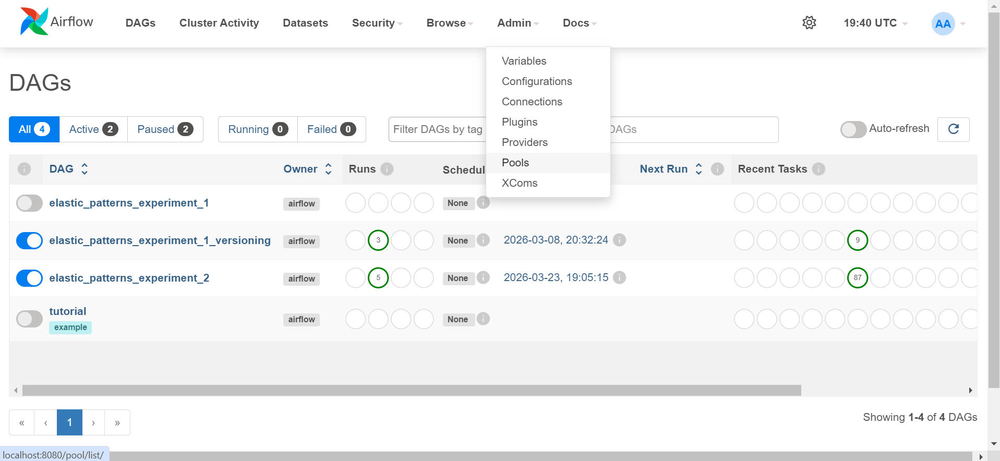

  * Create a Pool

  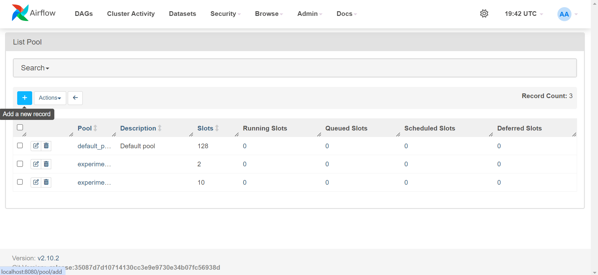

  * Insert a Pool name (for example, experiment_1_pool), and a number of Slots(for example, two), then Save it.
  
  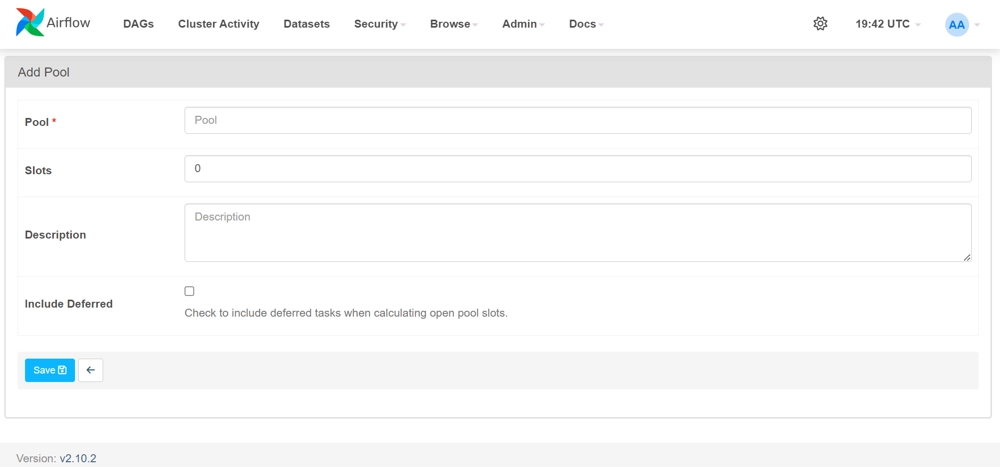

6. Go to Experiment 2, in Airflow Home, go to the dag *elastic_patterns_experiment_2* and click on it .You can click on the Airflow logo in the upper-left corner of the screen to return to the home screen.

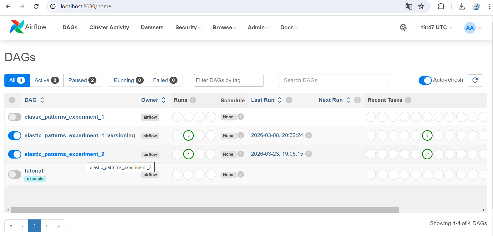

7. Inside the Airflow dag, you can run the experiment by clicking the button with the play icon in the upper-right corner. Once you do so, a new run will appear in the DAG's execution window, located in the middle-left part of the screen. In this window, you can now view information such as previous runs, run times, run logs, etc.

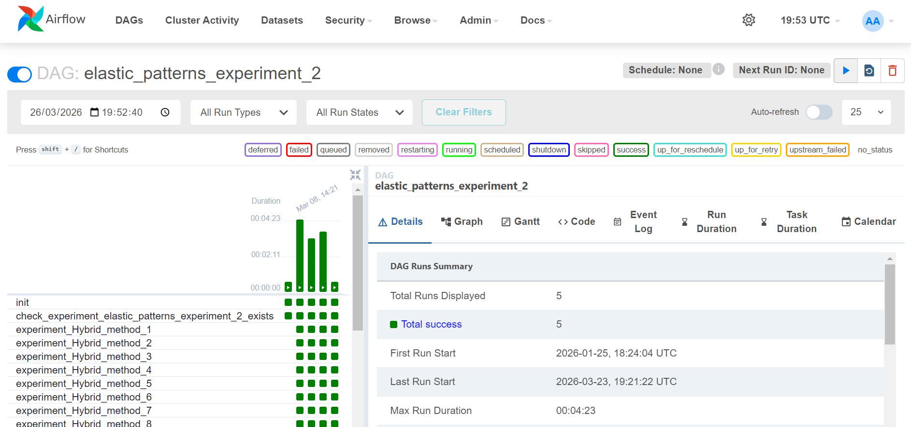

8. Once the run has started, you can view its progress in the Runs window; a vertical gray bar typically appears and grows upward. Clicking on this bar will cause the Runs window to display the current run. Once the entire experiment has finished running, each tested configuration is saved as a run in MLflow. For this experiment, a task (a node in a DAG) is generated for each configuration based on the three factors that make up each possible configuration, resulting in 84 tasks.

9. Go to Mlflow inteface http://localhost:5000/ and select the experiment *elastic_patterns_experiment_2* (same name that the Airflow dag).

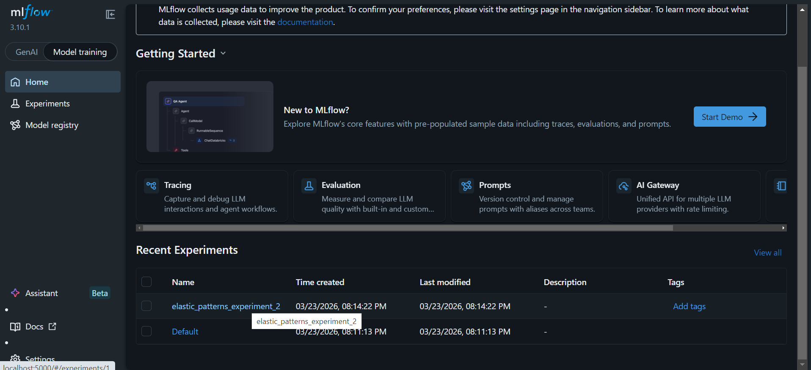

10. The list of runs (a configuration of the three factors) is show, now some analysis could be easily done. The set of runs is displayed in a table. This table shows information such as the run's registration time (the duration of the MLflow context), which should not be confused with the experiment's execution time, input parameters, metrics obtained, etc.

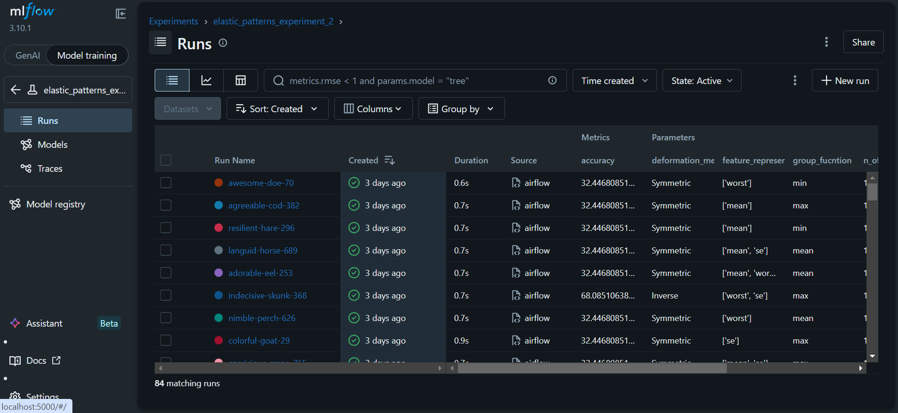

11. Select all the runs, with the checkbox on the left side of the table showing the list of runs, this will select all runs, or you can choose only the runs you want, and click on *Compare* button

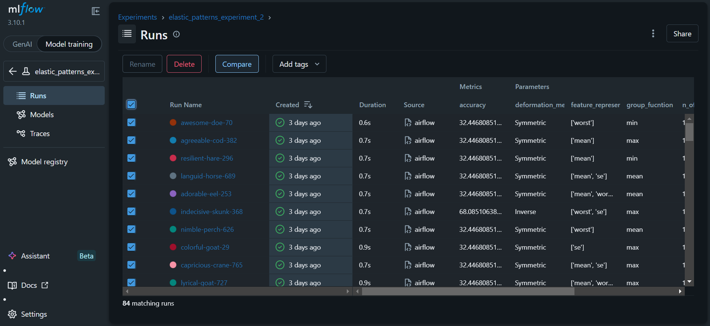

12. An initial overview of the input parameters and available metrics is provided, allowing users to switch between different types of graphs and different sets of parameters and metrics. In the context of this experiment, *Experiment 2*, it can be seen that in terms of *accuracy*, the experiment configuration that yields the best results is the *Inverse* deformation method, using the *Mean* ggregation strategy, as indicated by the darker red lines.

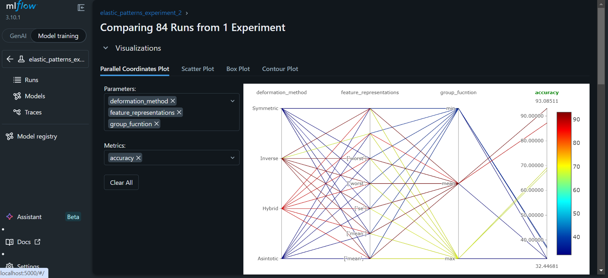